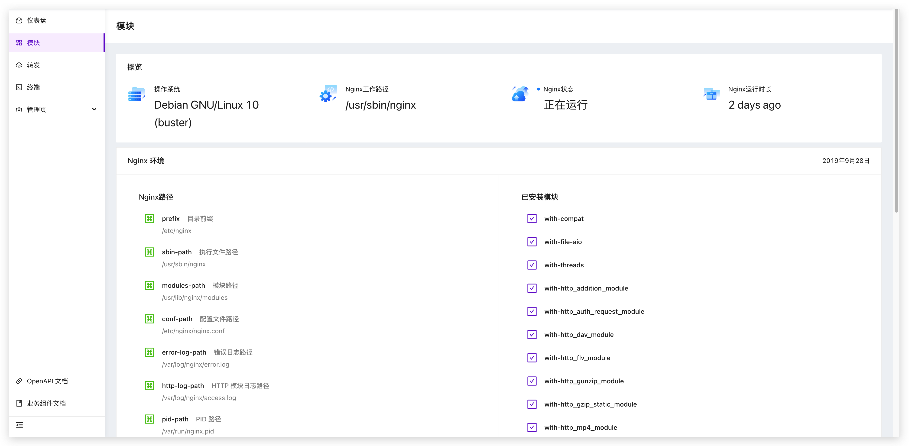
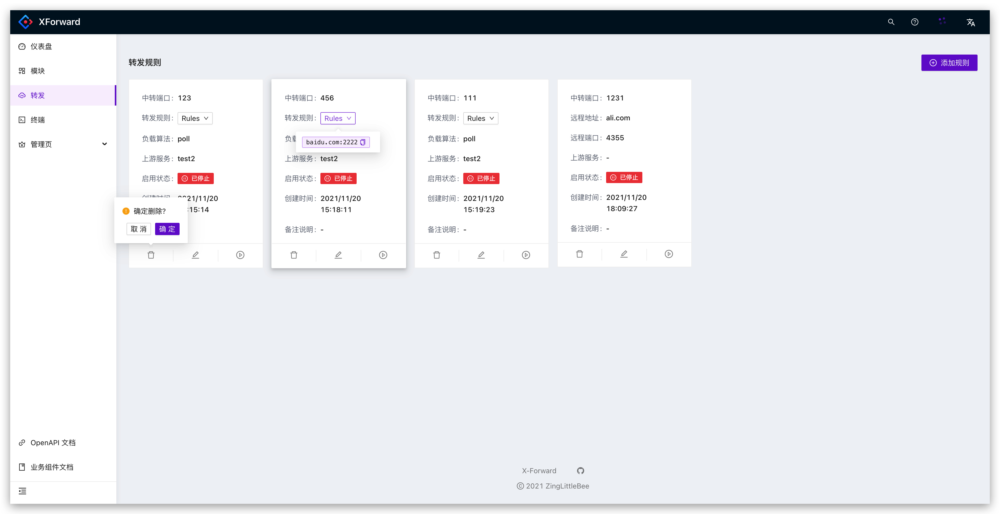
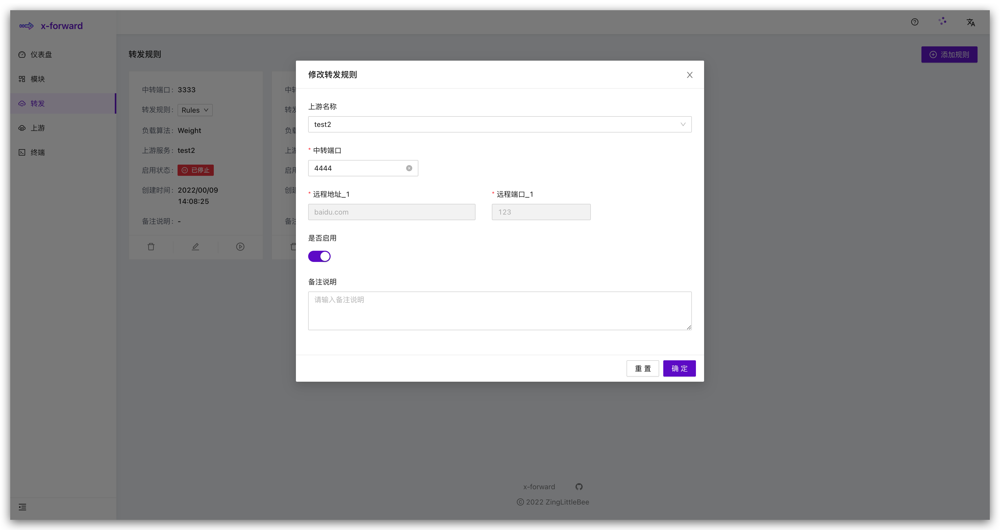
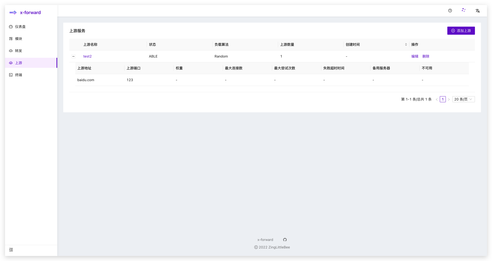
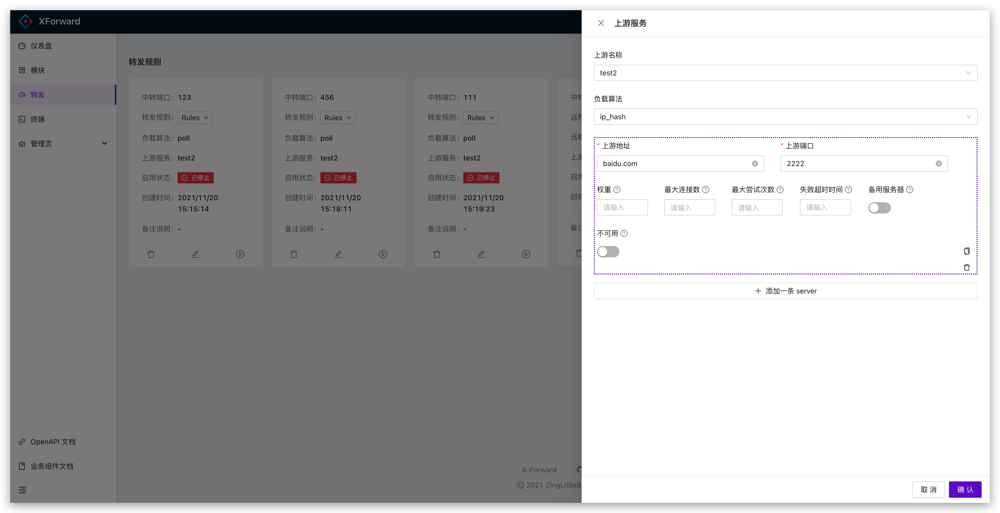

  
  
An Ambitious NginxUI for Stream.

  
  

> Coming soon ⚡️
>
> -   New UI base [daisyui](https://github.com/saadeghi/daisyui)
> -   New JavaScript Framework build with `Vue3`、`Pinia`、`Vue-Router`、`Vite`
> -   100% component libary build by my hand (may be come component libary in future)

## Introduction

### Features

-   Friendly UI
-   Easier Setup
-   Docker Support
-   Nginx Cluster Support
-   Rich Configuration Tips
-   Flexible Choice of Scenarios
-   Make Set the Stream Module More Easy
-   Local Web Terminal
-   Visual Log

## Table of Contents

-   [Introduction](#introduction)
    -   [Features](#features)
-   [Table of Contents](#table-of-contents)
-   [Getting Started](#getting-started)
    -   [Prerequisites](#prerequisites)
    -   [Installation](#installation)
-   [~~Snapshot~~](#snapshot)
    -   [~~Module~~](#module)
    -   [~~Terminal~~](#terminal)
    -   [~~Stream~~](#stream)
    -   [~~Upstream~~](#upstream)
-   [Roadmap](#roadmap)
-   [How to Develop](#how-to-develop)

## Getting Started

### Prerequisites

-   [Docker](https://docs.docker.com/engine/install/) (latest version preferred)

    or

-   [Node.js](https://nodejs.org) (>= 12.10 required, >= 14.17 preferred)
-   [npm](https://www.npmjs.com) (>= 6.x) or [yarn](https://yarnpkg.com) (>= 1.22)
-   [Git](https://git-scm.com) (>= 2.0)

### Installation

TODO

## ~~Snapshot~~

### ~~Module~~

### ~~Terminal~~

### ~~Stream~~

### ~~Upstream~~

## Roadmap

The following are the features I want to achieve or are under development:

-   [x] use pnpm workspace to manage multiple projects
-   [x] ~~build service use PKG for docker~~
-   [x] unit test
-   [x] support cluster
-   [x] batch operation, such as add, start, stop, restart, delete
-   [ ] config export and import
-   [ ] tcp delay on rule card
-   [ ] x-forward-cli, install uninstall update
-   [ ] client manage page
-   [ ] user system
-   [ ] control traffic
-   [ ] log dashboard
-   [ ] ssh for client
-   [ ] better UI

## How to Develop

1. Build dependencies
   `pnpm install`
2. Run project
   `pnpm start`
