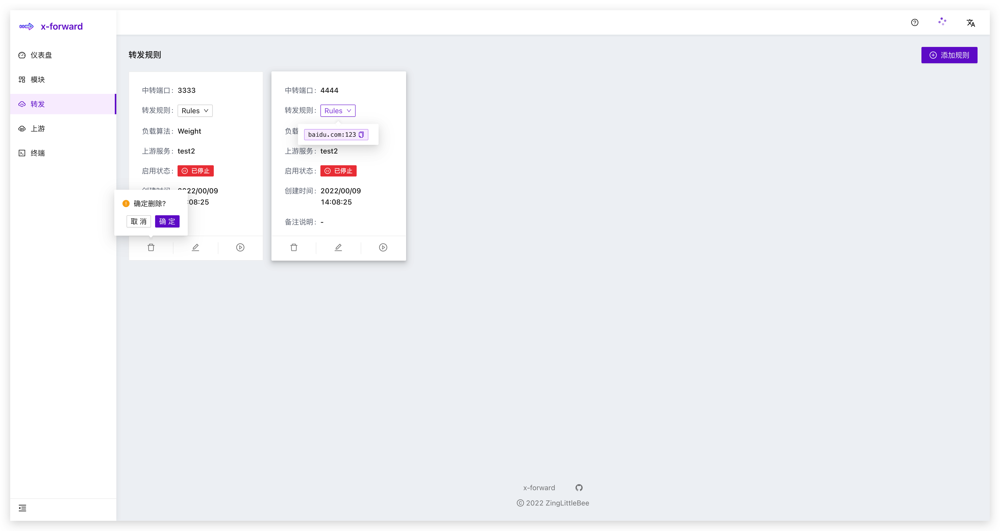
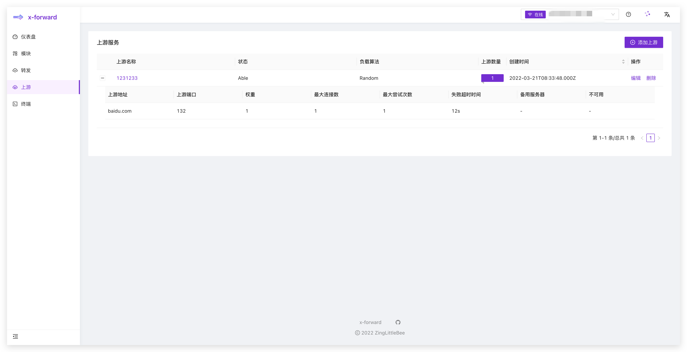

  
  
An Ambitious NginxUI for Stream.

  
  

## Introduction

### Features

-   Friendly UI
-   Easier Setup
-   Docker Support
-   Nginx Cluster Support
-   Rich Configuration Tips
-   Flexible Choice of Scenarios
-   Make Set the Stream Module More Easy
-   Local Web Terminal
-   Visual Log

## Table of Contents

- [Introduction](#introduction)
  - [Features](#features)
- [Table of Contents](#table-of-contents)
- [Getting Started](#getting-started)
  - [Prerequisites](#prerequisites)
  - [Installation](#installation)
- [Snapshot](#snapshot)
  - [模块管理](#模块管理)
  - [本地终端](#本地终端)
  - [Stream 模块](#stream-模块)
  - [Upstream 模块](#upstream-模块)
- [Roadmap](#roadmap)
- [How to Develop](#how-to-develop)
- [Thanks](#thanks)
- [Change Logs](#change-logs)

## Getting Started

### Prerequisites

-   [Docker](https://docs.docker.com/engine/install/) (latest version preferred)

    or

-   [Node.js](https://nodejs.org) (>= 12.10 required, >= 14.17 preferred)
-   [npm](https://www.npmjs.com) (>= 6.x) or [yarn](https://yarnpkg.com) (>= 1.22)
-   [Git](https://git-scm.com) (>= 2.0)

### Installation

TODO

## Snapshot

### 模块管理

### 本地终端

### Stream 模块

### Upstream 模块

## Roadmap

The following are the features I want to achieve or are under development:

-   [x] ~~整合前端, 后端, 部署模块到一个 project 中 power by lerna~~使用 pnpm workspace
-   [x] 使用 pkg 构建后端模块, 放入容器使用
-   [x] 数据库存储表的 crud
-   [x] 更新实体关系
-   [ ] 单元测试
-   [ ] 前端 API 对接
-   [ ] deploy 相关的 dockerfile 和 shell 脚本
-   [ ] 多服务器管理

## How to Develop

1. Build dependencies
   `pnpm install`
2. Run project
   `pnpm start`

## Thanks

-   React
-   Ant Design
-   Nginx
-   Node
-   NestJS
-   SocketIO
-   Xterm
-   Node-pty
-   TailWindCSS

## Change Logs

-   2021-09-05: 添加 module 页面
-   2021-09-21: 添加本地终端功能
-   2021-10-03: nginx 系统配置读取
-   2021-10-07: 根据模版文件生成 conf
-   2021-10-13: 环境相关功能模块分离, 实现 x-forward in local, nginx in docker, ExecutorInterface 功能接口
-   2021-10-20:
    1. add local-executor
    2. import pkg to package nest.js project into an executable
-   2021-10-25:
    1. change sqlite engine
    2. relieve coupling with .env
-   2021-10-27: add stream file patch function
-   2021-10-30: add 'upstream' module
-   2021-11-01:
    1. add patch-event
    2. change stream entity
    3. use gateway dispatch request
-   2021-11-09: finish backend function basically
-   -   2021-11-13:
    1. update user module and add exception filter
    2. fixed may be joined undefined
    3. update dep
-   2021-11-14:
    1. add nginx status executor
    2. improve api document
-   2021-11-17: add SystemInfo
-   2021-11-18: make calls more concise
-   2021-11-21: change some controller
-   2021-12-06: filling @AutoMap on Dto
-   2021-12-19: use pnpm workspace
-   2021-12-25: unit test
-   2021-12-30: stripping common components
-   2022-01-04: create executor lib
-   2022-01-05: create lib render
-   2022-01-10: add action of editor and delete on upstream page
-   2022-01-14: handle possible undefined
-   2022-01-15: update logo and favicon
-   2022-01-16: add field validator
-   2022-01-16: add param verify in api
-   2022-01-25: use mongo to store nginx logs
-   2022-02-07: add logs and client module
-   2022-02-15: use jwt to auth
-   2022-02-16: add register module on client
