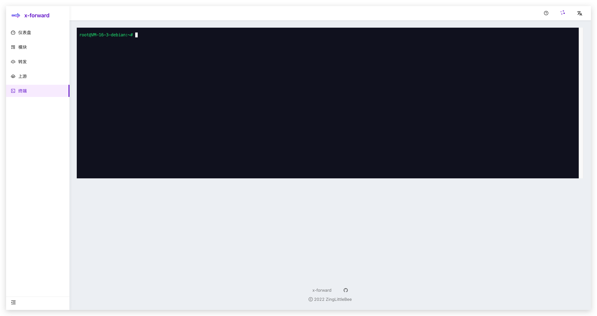
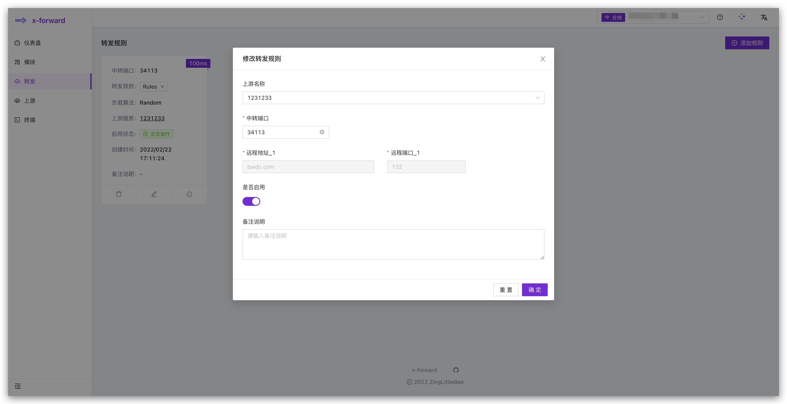

  
  
An Ambitious NginxUI for Stream.

  
  

## Introduction

### Features

-   Friendly UI
-   Easier Setup
-   Docker Support
-   Nginx Cluster Support
-   Rich Configuration Tips
-   Flexible Choice of Scenarios
-   Make Set the Stream Module More Easy
-   Local Web Terminal
-   Visual Log

## Table of Contents

- [Introduction](#introduction)
  - [Features](#features)
- [Table of Contents](#table-of-contents)
- [Getting Started](#getting-started)
  - [Prerequisites](#prerequisites)
  - [Installation](#installation)
- [Snapshot](#snapshot)
  - [模块管理](#模块管理)
  - [本地终端](#本地终端)
  - [Stream 模块](#stream-模块)
  - [Upstream 模块](#upstream-模块)
- [Roadmap](#roadmap)
- [How to Develop](#how-to-develop)
- [Thanks](#thanks)
- [Change Logs](#change-logs)

## Getting Started

### Prerequisites

-   [Docker](https://docs.docker.com/engine/install/) (latest version preferred)

    or

-   [Node.js](https://nodejs.org) (>= 12.10 required, >= 14.17 preferred)
-   [npm](https://www.npmjs.com) (>= 6.x) or [yarn](https://yarnpkg.com) (>= 1.22)
-   [Git](https://git-scm.com) (>= 2.0)

### Installation

TODO

## Snapshot

### 模块管理

### 本地终端

### Stream 模块

### Upstream 模块

## Roadmap

The following are the features I want to achieve or are under development:

- [x] use pnpm workspace to manage multiple projects
- [x] build service use PKG for docker
- [x] unit test
- [x] support cluster
- [ ] x-forward-cli, install uninstall update
- [ ] client manage page
- [ ] user system
- [ ] control traffic
- [ ] log dashboard
- [ ] ssh for client
- [ ] better UI

## How to Develop

1. Build dependencies
   `pnpm install`
2. Run project
   `pnpm start`

## Thanks

-   React
-   Ant Design
-   Nginx
-   Node
-   NestJS
-   SocketIO
-   Xterm
-   Node-pty
-   TailWindCSS

## Change Logs
